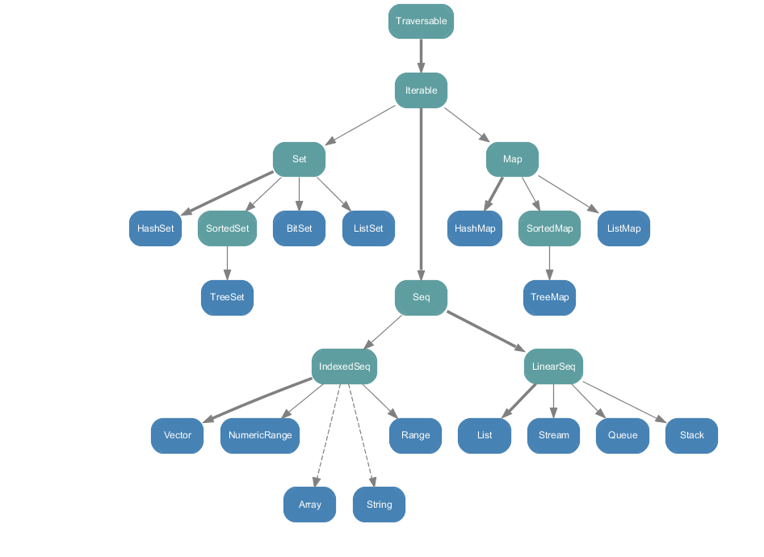
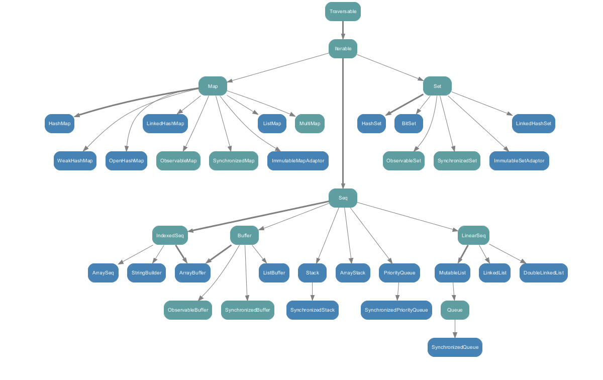
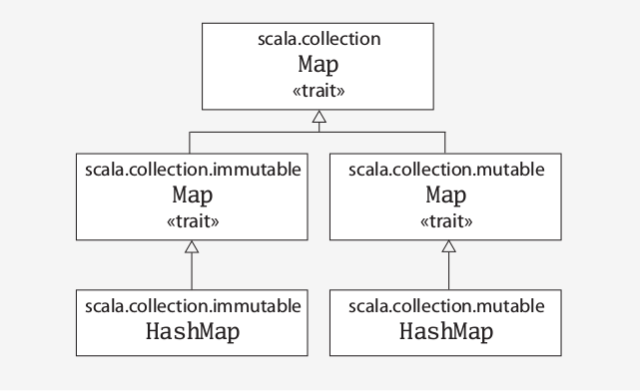

# Leo Spark Notes

## Note
* Case class used in spark should not be defined within a function (normally the main function) otherwise the program could rise "Malformed class name" or "class could not converted to bean" exception! [e.g](https://stackoverflow.com/questions/37959985/spark-udaf-java-lang-internalerror-malformed-class-name)
* In scala the priority of operator -> is higher than operator +, so that value expression of a map should be wrapped with parentheses: e.g. k->(v+1) is OK while k->v+1 reports compile errors.
* In Spark dataframe.map use `row.getAs[java.lang.Double]("abc")` instead of `row.getAs[Double]("abc")` when the column "abc" might have null values. java.lang.Double is the Java Double class that is nullable, while Double is default to be the scala Double class that is not nullable.
* Spark SQL `<=>` operator: Returns same result with EQUAL(=) operator for non-null operands, but returns TRUE if both are NULL, FALSE if one of the them is NULL.[ref](https://stackoverflow.com/questions/41469327/spark-sql-operator)
* Use `<=>` to replace `===` in all conditions, as `===` operator may lead to wrong result when using mulitple join conditions.
* To deal with data skew, use broadcast joins (aka Map-Side Joins) when one small table can be loaded to the memory:
```scala
// Force BroadcastHashJoin with broadcast hint (as function)
val qBroadcast = spark.range(100).as("a").join(broadcast(spark.range(100)).as("b")).where($"a.id" === $"b.id")
scala> qBroadcast.explain
== Physical Plan ==
*BroadcastHashJoin [id#14L], [id#18L], Inner, BuildRight
:- *Range (0, 100, step=1, splits=8)
+- BroadcastExchange HashedRelationBroadcastMode(List(input[0, bigint, false]))
   +- *Range (0, 100, step=1, splits=8)
```
* Spark bug: `dataframe.groupBy($"x").agg(UserDefinedAggregator("y"), countDistinct($"z"), countDistinct($"a"))` would report `java.lang.RuntimeException: Couldn't find "z"`! Fix: use a user defined Aggregator for countDistint to replace the countDistint in spark.
* Use `dataframe.groupByKey(f1(Row=>K)).mapGroups(f2(K,Iterator[Row]=>(col1, col2,...)))` instead of `dataframe.groupBy($"x").agg(UserDefinedAggregator1("y"), UserDefinedAggregator2("z"), ...)` and implement all groupby statistics in f2 when there are many UserDefinedAggregators with complex buffer structures (e.g. Map). This approach reduces the shuffle size as it uses a local mapGroup function in reducers to calculate all statistics and process all data for a key, avoiding complex buffer structure being shuffled if many UserDefinedAggregators are used.
*  It is important that you persist/cache your RDD first before checkpointing as checkpointing will materialise the RDD twice, once when it builds it for use and again when it needs to write it to disk - however if you have cached it before hand, it only needs to materialise it once, the second time it can read from the cache.

## Tutorial
* [Spark SQL, DataFrames and Datasets Guide](https://spark.apache.org/docs/latest/sql-programming-guide.html)
* How-to: Translate from MapReduce to Apache Spark [part1](https://blog.cloudera.com/blog/2014/09/how-to-translate-from-mapreduce-to-apache-spark/)[part2](http://blog.cloudera.com/blog/2015/04/how-to-translate-from-mapreduce-to-apache-spark-part-2/)
* Scala [Mutable and Immutable Collections](https://www.scala-lang.org/docu/files/collections-api/collections_1.html)
* [Dependency Management with Spark](http://theckang.com/2016/dependency-management-with-spark/)
* [Understanding your Apache Spark Application Through Visualization](https://databricks.com/blog/2015/06/22/understanding-your-spark-application-through-visualization.html)|[Monitoring Spark Applications](https://www.cloudera.com/documentation/enterprise/5-9-x/topics/operation_spark_applications.html)
* [Improving Spark Performance With Partitioning](https://dev.sortable.com/spark-repartition/)
* [Case Study: Number of Partitions for groupBy Aggregation](https://jaceklaskowski.gitbooks.io/mastering-spark-sql/spark-sql-performance-tuning-groupBy-aggregation.html)
* [Spark Hint Framework (Spark SQL 2.2)](https://jaceklaskowski.gitbooks.io/mastering-spark-sql/spark-sql-hint-framework.html)
* [Spark SQL Skew Join Optimization](https://docs.databricks.com/spark/latest/spark-sql/skew-join.html)
* [Apache Spark User Defined Functions](https://alvinhenrick.com/2016/07/10/apache-spark-user-defined-functions/)
* [Troubleshooting and Tuning Spark for Heavy Workloads](https://developer.ibm.com/hadoop/2016/07/18/troubleshooting-and-tuning-spark-for-heavy-workloads/)
* [How To Use Spark Transformations Efficiently For MapReduce-Like Jobs](http://technology.finra.org/code/using-spark-transformations-for-mpreduce-jobs.html)
* [Scala’s immutable collections can be slow as a snail](https://medium.com/@hussachai/scalas-immutable-collections-can-be-slow-as-a-snail-da6fc24bc688)
* [Tuning Spark](http://spark.apache.org/docs/latest/tuning.html)
* [RDD Programming Guide](http://spark.apache.org/docs/latest/rdd-programming-guide.html)
* [Tuning Java Garbage Collection for Apache Spark Applications](https://databricks.com/blog/2015/05/28/tuning-java-garbage-collection-for-spark-applications.html)
* [Spark sql function and examples](https://spark.apache.org/docs/2.3.0/api/sql/index.html)

## Userful Configuration | [Spark SQLConf](https://github.com/apache/spark/blob/master/sql/catalyst/src/main/scala/org/apache/spark/sql/internal/SQLConf.scala) | [Spark Configuration](https://spark.apache.org/docs/latest/configuration.html)
Name | Default | Description
--- | --- | ---
spark.sql.autoBroadcastJoinThreshold | 10L * 1024 * 1024 (10M) | Maximum size (in bytes) for a table that will be broadcast to all worker nodes when performing a join. If the size of the statistics of the logical plan of a table is at most the setting, the DataFrame is broadcast for join. Negative values or 0 disable broadcasting. Use SQLConf.autoBroadcastJoinThreshold method to access the current value.
spark.sql.shuffle.partitions | 200 | Number of partitions to use by default when shuffling data for joins or aggregations Corresponds to Apache Hive’s mapred.reduce.tasks property that Spark considers deprecated. Use SQLConf.numShufflePartitions method to access the current value.
spark.sql.objectHashAggregate.sortBased.fallbackThreshold | 128 | In the case of ObjectHashAggregateExec, when the size of the in-memory hash map grows too large, we will fall back to sort-based aggregation. This option sets a row count threshold for the size of the hash map. We are trying to be conservative and use a relatively small default count threshold here since the state object of some TypedImperativeAggregate function can be quite large (e.g. percentile_approx).
spark.task.maxFailures | 4 | Number of failures of any particular task before giving up on the job. The total number of failures spread across different tasks will not cause the job to fail; a particular task has to fail this number of attempts. Should be greater than or equal to 1. Number of allowed retries = this value - 1.
spark.yarn.max.executor.failures | numExecutors * 2, with minimum of 3 | The maximum number of executor failures before failing the application.
spark.sql.files.maxPartitionBytes | 134217728 (128 MB) | The maximum number of bytes to pack into a single partition when reading files.
spark.blacklist.enabled | false | If set to "true", prevent Spark from scheduling tasks on executors that have been blacklisted due to too many task failures. The blacklisting algorithm can be further controlled by the other "spark.blacklist" configuration options.
spark.network.timeout | 120s | Default timeout for all network interactions. This config will be used in place of spark.core.connection.ack.wait.timeout, spark.storage.blockManagerSlaveTimeoutMs, spark.shuffle.io.connectionTimeout, spark.rpc.askTimeout or spark.rpc.lookupTimeout if they are not configured.
spark.blacklist.enabled | false | If set to "true", prevent Spark from scheduling tasks on executors that have been blacklisted due to too many task failures. The blacklisting algorithm can be further controlled by the other "spark.blacklist" configuration options.
spark.debug.maxToStringFields | 25 | The performance overhead of creating and logging strings for wide schemas can be large. To imit the impact, we bound the number of fields to include by default. This can be overridden by setting the 'spark.debug.maxToStringFields' conf in SparkEnv.
spark.sql.autoBroadcastJoinThreshold | 10485760 (10 MB) | Configures the maximum size in bytes for a table that will be broadcast to all worker nodes when performing a join. By setting this value to -1 broadcasting can be disabled. Note that currently statistics are only supported for Hive Metastore tables where the command ANALYZE TABLE <tableName> COMPUTE STATISTICS noscan has been run.
spark.sql.broadcastTimeout | 300 | Timeout in seconds for the broadcast wait time in broadcast joins.
spark.default.parallelism | |Default number of partitions in RDDs returned by transformations like join, reduceByKey, and parallelize when not set by user. Config this number to avoid partition number increasing exponentially when iteratively join rdd/dataframes.


## Data Structure
* scala.collection:

* scala.collection.immutable:

* scala.collection.mutable:

* scala.collection.Map (By default, a Scala Map is immutable):


## Q&A
* [Spark iteration time increasing exponentially when using join](https://stackoverflow.com/questions/31659404/spark-iteration-time-increasing-exponentially-when-using-join)
* [How to define and use a User-Defined Aggregate Function in Spark SQL?](https://stackoverflow.com/questions/32100973/how-to-define-and-use-a-user-defined-aggregate-function-in-spark-sql?utm_medium=organic&utm_source=google_rich_qa&utm_campaign=google_rich_qa)
* [Multi-Column Key and Value – Reduce a Tuple in Spark](http://dmtolpeko.com/2015/02/12/multi-column-key-and-value-reduce-a-tuple-in-spark/)
* [Apply a custom Spark Aggregator on multiple columns (Spark 2.0)](https://stackoverflow.com/questions/33899977/how-to-define-a-custom-aggregation-function-to-sum-a-column-of-vectors?utm_medium=organic&utm_source=google_rich_qa&utm_campaign=google_rich_qa)
* [How to select the first/max/min row of each group?](https://stackoverflow.com/questions/33878370/how-to-select-the-first-row-of-each-group)
* __What happens if my dataset does not fit in memory?__ Often each partition of data is small and does fit in memory, and these partitions are processed a few at a time. For very large partitions that do not fit in memory, Spark's built-in operators perform external operations on datasets.
* __What happens when a cached dataset does not fit in memory?__ Spark can either spill it to disk or recompute the partitions that don't fit in RAM each time they are requested. By default, it uses recomputation, but you can set a dataset's storage level to MEMORY_AND_DISK to avoid this.
* [How to optimize shuffle spill in Apache Spark application](https://stackoverflow.com/questions/30797724/how-to-optimize-shuffle-spill-in-apache-spark-application)
* [Spark custom aggregation : collect_list+UDF vs UDAF](https://stackoverflow.com/questions/49294294/spark-custom-aggregation-collect-listudf-vs-udaf)
* [Spark group concat __wm_concat__ equivalent in scala dataframe:](https://stackoverflow.com/questions/34150547/spark-group-concat-equivalent-in-scala-rdd) concat_ws(";", collect_list($"col_name"))
* __whats the difference between checkpoints and using persist(DISK_ONLY)?__
persisting will materialise and save the RDD in memory or disk or both depending on your configuration and will also store and remember the lineage. This means that if there are Node failures on the node storing your cached RDD, they can be rebuilt using the lineage. Checkpoints do not store the lineage and will only write RDD contents to disk. If you are in a noisey cluster, checkpointing may also help to store RDD’s to files within HDFS saving memory. Otherwise it is recommended to only use checkpoints when your RDD lineage gets too large.

## Other
* [External shuffle service registration timeout is very short with heavy workloads when dynamic allocation is enabled](https://jira.apache.org/jira/browse/SPARK-19528)
